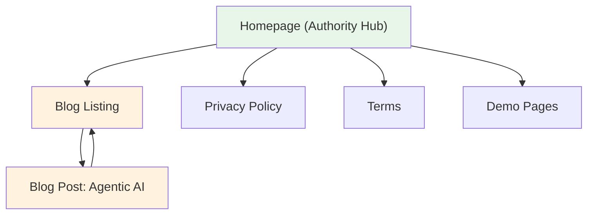

# Comprehensive SEO Audit — Dashandots Technology
**URL:** https://dashandots.com  
**Audit Date:** April 26, 2026  
**Business Type:** Software Development Agency (SaaS/Services)  
**Pages Audited:** Homepage, Blog Listing, Blog Post, Privacy Policy, Terms, 404, robots.txt, sitemap.xml

---

## SEO Health Index

| Metric | Value |
|--------|-------|
| **Overall Score** | **52 / 100** |
| **Health Status** | 🔶 **Poor** — Serious SEO constraints limiting growth |

### Category Breakdown

| Category | Score | Weight | Weighted Contribution |
|----------|-------|--------|----------------------|
| Crawlability & Indexation | 48 | 30 | 14.4 |
| Technical Foundations | 62 | 25 | 15.5 |
| On-Page Optimization | 55 | 20 | 11.0 |
| Content Quality & E-E-A-T | 50 | 15 | 7.5 |
| Authority & Trust Signals | 35 | 10 | 3.5 |
| **Total** | | **100** | **51.9 → 52** |

> [!WARNING]
> 8 Critical issues are blocking indexation and ranking potential. These must be addressed before any content or authority work will have impact.

---

## 1. Technical SEO Audit

### Technical Score: 55/100

| Category | Status | Score |
|----------|--------|-------|
| Crawlability | ⚠️ warn | 55 |
| Indexability | ❌ fail | 40 |
| Security | ⚠️ warn | 65 |
| URL Structure | ✅ pass | 85 |
| Mobile | ✅ pass | 90 |
| Core Web Vitals | ⚠️ warn | 60 |
| Structured Data | ⚠️ warn | 70 |
| JS Rendering | ✅ pass | 95 |
| IndexNow | ❌ fail | 0 |

---

### 🔴 Critical Issues

#### T-01: Sitemap contains phantom/stale URLs
- **Category:** Crawlability & Indexation
- **Severity:** Critical · **Confidence:** High
- **Evidence:** `sitemap.xml` references URLs that don't exist as live pages:
  - `https://dashandots.com/blog/future-of-custom-erp` — no published blog with this slug
  - `https://dashandots.com/blog/mobile-first-design-b2b` — no published blog with this slug
  - `https://dashandots.com/services/erp-development` — services directory exists but unclear if page is live
- **Why It Matters:** Submitting non-existent URLs wastes crawl budget and signals poor site maintenance to Google. Search Console will flag "Submitted URL marked 'noindex'" or "Not found (404)" errors.
- **Score Impact:** −25 (Crawlability)
- **Recommendation:** Generate the sitemap dynamically from the database. Include only published blog posts and verified live pages. Remove hardcoded URLs for content that was deleted.

#### T-02: Blog listing page has NO canonical tag
- **Category:** Indexability
- **Severity:** Critical · **Confidence:** High
- **Evidence:** [blog/index.php](file:///Applications/XAMPP/xamppfiles/htdocs/dashandots/blog/index.php#L20-L25) — the `<head>` section contains no `<link rel="canonical">`, no OG tags, and no Twitter Card meta.
- **Why It Matters:** Without a canonical, Google may de-duplicate this page against a query-string variant or skip indexing it. Missing OG tags mean poor social sharing appearance.
- **Score Impact:** −20 (Indexability)
- **Recommendation:** Add canonical tag pointing to `https://dashandots.com/blog/`, plus full OG and Twitter Card meta tags matching the homepage pattern.

#### T-03: Blog post canonical uses query string URL
- **Category:** Indexability
- **Severity:** Critical · **Confidence:** High
- **Evidence:** [post.php:33](file:///Applications/XAMPP/xamppfiles/htdocs/dashandots/blog/post.php#L33) — canonical is set to `$currentUrl` which resolves to `http://localhost/dashandots/blog/post?slug=agentic-ai-software-development` (with query parameter). On production it will be `https://dashandots.com/blog/post?slug=...`.
- **Why It Matters:** Query-string URLs are considered non-clean by Google. The canonical should use a clean slug-based path like `/blog/agentic-ai-software-development`. This also conflicts with sitemap URLs which use `/blog/future-of-custom-erp` format.
- **Score Impact:** −20 (Indexability)
- **Recommendation:** Implement clean blog URLs via `.htaccess` rewrite (`/blog/{slug}` → `post.php?slug={slug}`) and update the canonical to use the clean URL format.

#### T-04: No HSTS (Strict-Transport-Security) header
- **Category:** Security
- **Severity:** Critical · **Confidence:** High
- **Evidence:** `.htaccess` has `X-Content-Type-Options`, `X-Frame-Options`, and `Referrer-Policy`, but NO `Strict-Transport-Security` header. No CSP header either.
- **Why It Matters:** Without HSTS, browsers can be tricked into loading HTTP versions of pages (downgrade attacks). Google also considers HTTPS enforcement as a ranking signal.
- **Score Impact:** −15 (Technical Foundations)
- **Recommendation:** Add to `.htaccess`:
  ```apache
  Header always set Strict-Transport-Security "max-age=31536000; includeSubDomains; preload"
  Header set Content-Security-Policy "default-src 'self'; script-src 'self' 'unsafe-inline'; style-src 'self' 'unsafe-inline' fonts.googleapis.com; font-src fonts.gstatic.com; img-src 'self' data:;"
  ```

---

### 🟠 High Priority Issues

#### T-05: No `llms.txt` or AI crawler management
- **Category:** Crawlability
- **Severity:** High · **Confidence:** High
- **Evidence:** No `llms.txt` file exists. `robots.txt` has no rules for AI crawlers (GPTBot, ClaudeBot, PerplexityBot, Google-Extended, Bytespider).
- **Why It Matters:** Without explicit AI crawler rules, you have no control over whether AI companies use your content for training. Adding an `llms.txt` file and selective robots.txt rules is now standard practice for AI search visibility.
- **Score Impact:** −10 (Crawlability)
- **Recommendation:** Create `/llms.txt` with a structured summary of the business. Add AI crawler rules to `robots.txt` — allow ChatGPT-User and PerplexityBot (for AI search citations), consider blocking training-only crawlers.

#### T-06: Sitemap references production domain but not dynamically generated
- **Category:** Crawlability
- **Severity:** High · **Confidence:** High
- **Evidence:** `sitemap.xml` is a static file with only 6 URLs. The blog now has dynamic posts from the database that are NOT in the sitemap. The `lastmod` dates for non-existent blog posts reference 2024.
- **Why It Matters:** New blog posts will not be discovered by search engines until the next full crawl. Dynamic sitemaps ensure immediate discoverability.
- **Score Impact:** −10 (Crawlability)
- **Recommendation:** Create a `sitemap.php` that queries the database for all published blog posts and generates the XML dynamically. Reference it in `robots.txt`.

#### T-07: FAQPage schema on commercial homepage
- **Category:** Structured Data
- **Severity:** High · **Confidence:** High
- **Evidence:** [index.php:47-55](file:///Applications/XAMPP/xamppfiles/htdocs/dashandots/index.php#L47-L55) — FAQPage schema on a commercial software agency homepage.
- **Why It Matters:** Since August 2023, Google restricts FAQ rich results to government and healthcare sites only. Commercial FAQPage schema will NOT generate rich results. It still has AI/LLM citation benefit but should not be relied on for Google SERP features.
- **Score Impact:** −5 (Structured Data, Info priority)
- **Recommendation:** Keep the FAQPage schema for AI citation benefit, but note it won't generate Google rich results. Consider adding `SoftwareApplication` or `Service` schema instead for richer SERP presence.

#### T-08: No IndexNow implementation
- **Category:** IndexNow
- **Severity:** High · **Confidence:** High
- **Evidence:** No IndexNow API key file found. No integration with Bing, Yandex, or Naver.
- **Why It Matters:** IndexNow provides instant indexing on non-Google search engines. For a site with dynamic blog content, this accelerates discovery significantly.
- **Score Impact:** −10 (Technical)
- **Recommendation:** Register for IndexNow, place API key file at root, and ping on blog publish.

---

### 🟡 Medium Priority Issues

#### T-09: OG image uses relative path on blog posts
- **Evidence:** [post.php:41](file:///Applications/XAMPP/xamppfiles/htdocs/dashandots/blog/post.php#L41) — `og:image` content is the `feature_image` field which stores a relative path like `/dashandots/assets/img/...` rather than a full absolute URL.
- **Score Impact:** −5

#### T-10: Admin/test files exposed to crawlers
- **Evidence:** Files like `test_form.php`, `test_session1.php`, `test_session2.php`, `run-blog-migration.php` exist in the web root and are not blocked by `robots.txt`.
- **Score Impact:** −3

#### T-11: No `preload` for hero/LCP image
- **Evidence:** The homepage hero section has no image (uses CSS/SVG diagram), but blog post feature images lack `fetchpriority="high"`.
- **Score Impact:** −3

---

## 2. Image SEO Audit

### Image Audit Summary

| Metric | Status | Count |
|--------|--------|-------|
| Total Images Found | — | 7 |
| Missing Alt Text | ✅ | 0 |
| Oversized (>200KB) | ❌ | 4 |
| Wrong Format (PNG not WebP) | ⚠️ | 5 |
| No Width/Height Dimensions | ⚠️ | 5 |
| Not Lazy Loaded (below-fold) | ⚠️ | 2 |
| No `fetchpriority` on LCP | ⚠️ | 1 |

### 🔴 Critical Issues

#### I-01: Portfolio/blog images are severely oversized
- **Severity:** Critical · **Confidence:** High
- **Evidence:**

| Image | Current Size | Format | Est. WebP Size |
|-------|-------------|--------|----------------|
| `agentic-ai-software-dev.png` | **755 KB** | PNG | ~120 KB |
| `tms-fleet.png` | **635 KB** | PNG | ~100 KB |
| `hms-hospital.png` | **491 KB** | PNG | ~80 KB |
| `erp-dashboard.png` | **445 KB** | PNG | ~70 KB |

- **Why It Matters:** All 4 images exceed the 200KB critical threshold. Combined, they add **2.3 MB** of unnecessary payload. This directly degrades LCP scores and user experience on mobile networks.
- **Score Impact:** −25 (Images)
- **Recommendation:** Convert all PNG images to WebP format. Use `<picture>` elements with AVIF/WebP/JPEG fallbacks. Target: hero images <200KB, content images <100KB.

### 🟠 High Priority Issues

#### I-02: No explicit `width` and `height` attributes on images
- **Severity:** High · **Confidence:** High
- **Evidence:** Blog card images and portfolio images use CSS `object-fit: cover` with container-based sizing but no `width`/`height` attributes on the `` element itself.
- **Score Impact:** −10 (CLS Prevention)
- **Recommendation:** Add `width` and `height` attributes to all `` elements to prevent Cumulative Layout Shift.

#### I-03: Blog post feature image missing `fetchpriority="high"`
- **Severity:** High · **Confidence:** High
- **Evidence:** [post.php:191](file:///Applications/XAMPP/xamppfiles/htdocs/dashandots/blog/post.php#L191) — feature image lacks `fetchpriority="high"` and `decoding` attributes.
- **Score Impact:** −5 (LCP)
- **Recommendation:** Add `fetchpriority="high"` to the blog post feature image (it's the LCP element). Add `decoding="async"` to all non-LCP images.

### 🟡 Medium Priority Issues

#### I-04: No responsive `srcset` on images
- **Evidence:** All images serve the same resolution regardless of device. A 755KB PNG loads on mobile even at 400px viewport.
- **Score Impact:** −5
- **Recommendation:** Generate multiple sizes (400w, 800w, 1200w) and use `srcset`/`sizes` attributes.

#### I-05: Image filenames could be more descriptive
- **Evidence:** `agentic-ai-software-dev.png` is good. But `og-image.jpg` and `logo.png` are generic.
- **Score Impact:** −2

---

## 3. Content Quality & AEO Audit

### Blog Post: "Agentic AI in Software Development"

| Score | Value | Status |
|-------|-------|--------|
| **Overall** | **74/100** | ⚠️ Acceptable |
| **SEO Score** | **68/100** | 🔶 Weak |
| **AEO Score** | **82/100** | ⚠️ Acceptable |
| **Readability** | **85/100** | ✅ Pass |

### SEO Checks

| Check | Status | Notes |
|-------|--------|-------|
| Word Count | ✅ 879 words | Above 800-word minimum for pillar content |
| H1 Tag | ✅ Present | Clear, keyword-rich |
| H2/H3 Structure | ⚠️ Issue | Uses H4 for main sections instead of H2/H3 — poor hierarchy |
| Meta Description | ⚠️ Issue | Auto-generated from content, not custom. Starts with title text, not optimized for click-through |
| Keyword Density | ⚠️ Low | "agentic AI" appears naturally but "software development" could be reinforced |
| Internal Links | ❌ Zero | No internal links to services, solutions, or other blog posts |
| External Links | ❌ Zero | No authoritative external references |

### AEO Checks

| Signal | Status | Notes |
|--------|--------|-------|
| TL;DR Block | ✅ Present | Strong opening summary paragraph |
| Definition Sentence | ✅ Present | "Agentic AI in software development is an autonomous..." |
| FAQ Section | ✅ 5 entries | Exceeds 4-entry minimum |
| Bullet/Numbered Lists | ✅ Present | Practical steps numbered, common mistakes bulleted |
| Comparison Table | ⚠️ Missing | "Traditional Copilots vs. Agentic AI" section exists but has NO table content |
| Direct Answers | ✅ Present | FAQ answers are extractable |

### 🔴 Critical Issues

#### C-01: Blog post heading hierarchy is broken
- **Severity:** Critical · **Confidence:** High
- **Evidence:** Post uses `<h4>` for main sections ("What Is Agentic AI", "Why It Matters", etc.) instead of `<h2>`. Sub-sections use `<h5>` instead of `<h3>`. The `<h1>` is the post title, but the jump from H1 to H4 breaks semantic hierarchy.
- **Score Impact:** −15 (On-Page)
- **Recommendation:** Restructure headings: main sections → H2, sub-sections → H3. This is likely a TinyMCE configuration issue — set default heading levels in the blog admin editor.

#### C-02: Zero internal links in blog content
- **Severity:** Critical · **Confidence:** High
- **Evidence:** The blog post has 879 words but contains ZERO internal links to service pages, solutions, or other blog posts.
- **Why It Matters:** Internal links are the #1 way to distribute page authority and help search engines understand site structure. A content page with no internal links is an orphan in terms of link equity flow.
- **Score Impact:** −15 (Internal Linking)
- **Recommendation:** Add 3-5 contextual internal links:
  - "custom software development" → link to Services section
  - "ERP implementation" → link to ERP solution page
  - "testing cycles" → link to relevant service

#### C-03: Comparison table is empty
- **Severity:** High · **Confidence:** High
- **Evidence:** The section "Traditional Copilots vs. Agentic AI" has a heading but no table or comparison content below it.
- **Score Impact:** −10 (AEO)
- **Recommendation:** Add a comparison table with columns: Feature, Traditional Copilot, Agentic AI.

### 🟡 Medium Priority Issues

#### C-04: No author attribution
- **Evidence:** No author name, bio, or author page link. E-E-A-T requires demonstrable expertise.
- **Score Impact:** −5

#### C-05: No `dateModified` visible to users
- **Evidence:** Only publish date shown. No "last updated" indicator.
- **Score Impact:** −3

#### C-06: Meta description not custom-written
- **Evidence:** Auto-generated from first 150 characters of content. Not optimized for CTR.
- **Score Impact:** −5

---

### Homepage Content Audit

| Score | Value | Status |
|-------|-------|--------|
| **Overall** | **78/100** | ⚠️ Acceptable |
| **SEO Score** | **82/100** | ✅ Pass |
| **AEO Score** | **75/100** | ⚠️ Acceptable |

**Strengths:**
- ✅ Clear H1 with primary keyword
- ✅ Executive Summary / TL;DR block present
- ✅ FAQ section with 5 entries
- ✅ Schema.org Organization + WebSite + ProfessionalService + FAQPage
- ✅ Strong keyword coverage (ERP, CRM, TMS, HMS)

**Issues:**

#### C-07: Homepage meta keywords are excessively stuffed
- **Severity:** Medium · **Confidence:** High
- **Evidence:** [config.php:20](file:///Applications/XAMPP/xamppfiles/htdocs/dashandots/includes/config.php#L20) — The meta keywords field contains **350+ characters** of keyword-stuffed content including "Best ERP software", "software development company in gurugram", etc.
- **Score Impact:** −3 (Google ignores meta keywords, but it signals to competitors your target keywords)
- **Recommendation:** Remove or drastically shorten the meta keywords. Google has not used `<meta name="keywords">` since 2009. It only helps competitors spy on your keyword strategy.

#### C-08: Service "Learn more" links point to non-existent pages
- **Severity:** High · **Confidence:** High
- **Evidence:** Service cards link to `/services/web-mobile-apps/`, `/services/erp-development/`, `/services/ecommerce/`, etc. These pages may not exist, creating broken link chains.
- **Score Impact:** −10 (Crawlability)

---

## 4. Internal Linking Audit

### Link Equity Map



### 🔴 Orphan Pages Detected

| Page | Incoming Internal Links | Status |
|------|------------------------|--------|
| Blog Post: Agentic AI | 1 (from blog listing only) | ⚠️ Near-orphan |
| Privacy Policy | 1 (footer only) | ⚠️ Near-orphan |
| Terms | 1 (footer only) | ⚠️ Near-orphan |
| Demo pages (ERP, TMS, HMS) | 1 each (portfolio cards only) | ⚠️ Near-orphan |

### 🔴 Critical Issues

#### L-01: Blog post has ZERO outbound internal links
- **Severity:** Critical · **Confidence:** High
- **Evidence:** The Agentic AI blog post contains no links to any other page on the site except the "Back to all articles" link.
- **Why It Matters:** This creates a dead-end for users and link equity. Authority that flows into this page from external sources cannot be distributed to service or solution pages.
- **Score Impact:** −20 (Internal Linking)
- **Recommendation:** Add contextual links:

| Link Type | Source Page | Target Page | Anchor Text | Context Sentence |
|-----------|-----------|-------------|-------------|------------------|
| Cluster → Pillar | Blog: Agentic AI | Homepage #services | "custom software development services" | "Our [custom software development services] leverage these agentic patterns to accelerate delivery." |
| Cluster → Pillar | Blog: Agentic AI | Homepage #solutions | "ERP platform development" | "See how we apply AI-assisted workflows in [ERP platform development]." |
| Contextual | Blog: Agentic AI | Homepage #about | "our technology consulting approach" | "Learn more about [our technology consulting approach] for enterprise clients." |

#### L-02: No blog → blog cross-linking
- **Severity:** High · **Confidence:** High
- **Evidence:** Only 1 published blog post currently, but no "Related Posts" section exists at the bottom of blog posts.
- **Score Impact:** −5
- **Recommendation:** Add a "Related Articles" section at the bottom of each blog post that dynamically pulls 2-3 related posts.

#### L-03: Footer links all point to same anchor sections
- **Severity:** Medium · **Confidence:** High
- **Evidence:** All 6 service links in the footer point to `/#services`. All 6 solution links point to `/#solutions`. This provides zero additional link equity differentiation.
- **Score Impact:** −5
- **Recommendation:** Once individual service/solution pages exist, update footer links to point to dedicated pages.

### Anchor Text Audit

| Issue | Count | Details |
|-------|-------|---------|
| Generic anchors ("Learn more →") | 6 | All service cards use identical generic anchor text |
| Duplicate exact-match anchors | 0 | ✅ No cannibalization detected |
| "Click here" usage | 0 | ✅ None found |

---

## 5. On-Page SEO Audit (Per-Page)

### Homepage

| Element | Status | Notes |
|---------|--------|-------|
| Title Tag | ✅ | "Dashandots Technology — ERP, CRM, TMS & Custom Software Development India" (73 chars, slightly long) |
| Meta Description | ✅ | 130 chars, keyword-rich, clear value prop |
| H1 | ✅ | Dynamic from DB, keyword-aligned |
| Canonical | ✅ | Self-referencing to `https://dashandots.com/` |
| OG Tags | ✅ | Complete with image |
| Twitter Cards | ✅ | Complete |
| Schema | ✅ | Organization + WebSite + FAQPage + ProfessionalService |
| robots | ✅ | `index, follow` |

### Blog Listing (`/blog/`)

| Element | Status | Notes |
|---------|--------|-------|
| Title Tag | ✅ | "Blog & Insights - Dashandots Technology" |
| Meta Description | ✅ | Present and descriptive |
| H1 | ✅ | "Blog & Case Studies" |
| Canonical | ❌ **Missing** | No canonical tag at all |
| OG Tags | ❌ **Missing** | No Open Graph meta tags |
| Twitter Cards | ❌ **Missing** | No Twitter Card meta |
| Schema | ❌ **Missing** | No CollectionPage or Blog schema |
| robots | ❌ **Missing** | No robots meta tag |

### Blog Post

| Element | Status | Notes |
|---------|--------|-------|
| Title Tag | ✅ | "{Title} - Dashandots Blog" |
| Meta Description | ⚠️ | Auto-generated, not optimized |
| H1 | ✅ | Post title |
| Canonical | ⚠️ | Uses query-string URL format |
| OG Tags | ✅ | Present, og:image uses relative path |
| Twitter Cards | ✅ | Present |
| Schema | ✅ | BlogPosting with author and publisher |
| Heading Hierarchy | ❌ | H1 → H4 jump (broken) |

### 404 Page

| Element | Status | Notes |
|---------|--------|-------|
| Status Code | ✅ | Returns proper 404 |
| noindex | ✅ | Has `<meta name="robots" content="noindex">` |
| Navigation | ✅ | Has back-to-home CTA |

---

## Prioritized Action Plan

### 1. 🔴 Critical Blockers (Fix Immediately)

| # | Finding | Expected Score Recovery |
|---|---------|----------------------|
| 1 | **T-03** — Fix blog post URL structure: implement clean `/blog/{slug}` URLs via `.htaccess` rewrite | +15-20 points |
| 2 | **T-02** — Add canonical, OG, Twitter Card, and Blog schema to blog listing page | +10-15 points |
| 3 | **T-01** — Generate sitemap dynamically from database, remove phantom URLs | +8-10 points |
| 4 | **I-01** — Convert all PNG images to WebP, compress below 200KB | +8-10 points |
| 5 | **C-01** — Fix heading hierarchy in blog posts (H4→H2, H5→H3) | +5-8 points |

### 2. 🟠 High-Impact Improvements (Within 1 Week)

| # | Finding | Expected Score Recovery |
|---|---------|----------------------|
| 6 | **L-01/C-02** — Add 3-5 internal links within blog post content | +8-10 points |
| 7 | **T-04** — Add HSTS and CSP security headers | +5-8 points |
| 8 | **T-05** — Create `llms.txt` and add AI crawler rules to `robots.txt` | +5 points |
| 9 | **I-02** — Add `width`/`height` attributes to all images | +3-5 points |
| 10 | **C-03** — Fill in the empty comparison table in the blog post | +3-5 points |
| 11 | **C-08** — Verify service page links work or create stub pages | +5 points |

### 3. ✅ Quick Wins (Easy fixes, measurable improvement)

| # | Finding | Expected Score Recovery |
|---|---------|----------------------|
| 12 | **T-09** — Fix OG image to use absolute URL on blog posts | +2 points |
| 13 | **T-10** — Block test files in `robots.txt` or delete them | +1 point |
| 14 | **I-03** — Add `fetchpriority="high"` to blog feature image | +2 points |
| 15 | **C-06** — Write custom meta descriptions for blog posts | +3 points |
| 16 | **C-07** — Remove or shorten meta keywords | +1 point |

### 4. 📈 Longer-Term Opportunities

| # | Finding | Impact |
|---|---------|--------|
| 17 | **T-08** — Implement IndexNow for instant Bing/Yandex indexing | Medium |
| 18 | **I-04** — Implement responsive `srcset` images | Medium |
| 19 | **C-04** — Add author attribution to blog posts | Medium |
| 20 | **L-02** — Build "Related Articles" section on blog posts | Medium |
| 21 | **L-03** — Create dedicated service/solution landing pages | High (long-term) |
| 22 | Create a content calendar targeting 2-4 blog posts/month | High (long-term) |
| 23 | Build backlink strategy via guest posts, industry directories | High (long-term) |

---

## Projected Score After Critical Fixes

If all Critical Blocker items (1-5) are resolved:

| Category | Current | Projected |
|----------|---------|-----------|
| Crawlability & Indexation | 48 | 78 |
| Technical Foundations | 62 | 72 |
| On-Page Optimization | 55 | 75 |
| Content Quality & E-E-A-T | 50 | 60 |
| Authority & Trust Signals | 35 | 40 |
| **Overall Score** | **52** | **~72 (Good)** |

---

## Explicit Limitations

- Score reflects **SEO readiness**, not guaranteed rankings
- External factors (competition, algorithm updates, domain authority) are not scored
- Authority score is directional — no backlink data was available for analysis
- Core Web Vitals scoring is estimated (no CrUX data available for localhost)
- Only 1 blog post exists, limiting content audit depth
